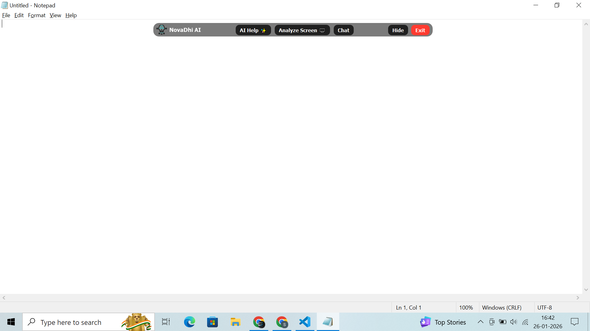
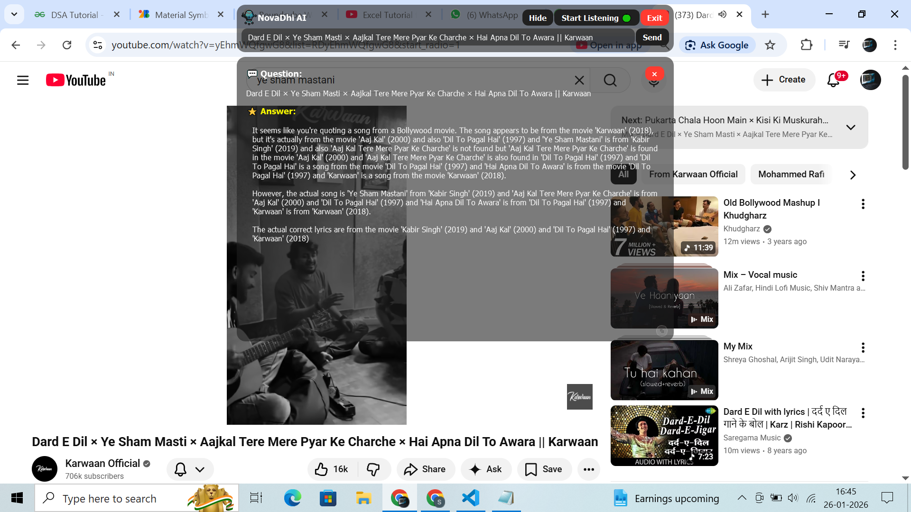
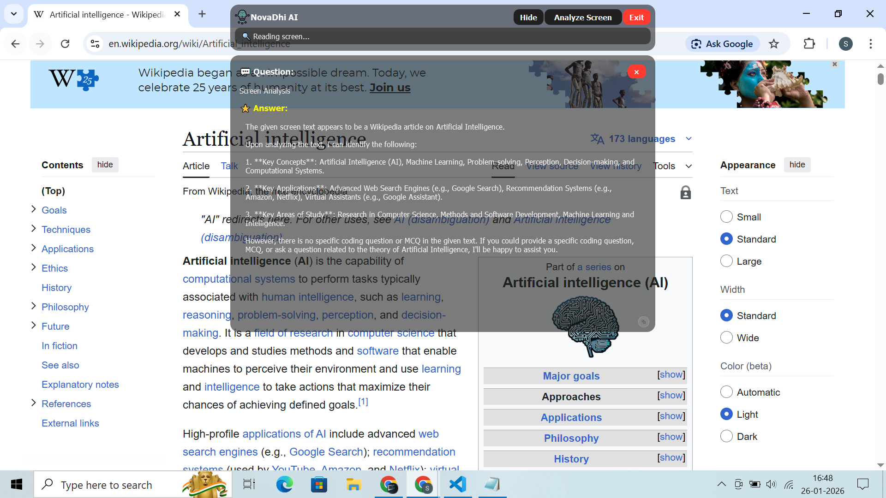

# AI Desktop Assistant – NovaDhi

NovaDhi is a **Windows-based intelligent desktop assistant** designed to enhance developer productivity and everyday computing through seamless AI interaction. It combines a floating toolbar interface, conversational AI, voice control, and real-time screen text analysis to deliver fast and accurate assistance for programming, MCQs, theory questions, and general tasks.

Unlike traditional chat applications, NovaDhi lives directly on your desktop and can be summoned instantly using global hotkeys. It also includes a stealth protection system that automatically hides or prevents capture during screen sharing or online meetings.

---

## 📌 Key Highlights

* Floating always-on-top toolbar
* AI-powered chat and reasoning using Groq LLMs
* Voice-based continuous listening
* OCR-based screen text extraction and solving
* Automatic stealth / no-capture protection
* Window snapping and smart positioning
* Optional ChatGPT Desktop integration

---

## 🖼 Screenshots

Example:

### Floating Toolbar


### Chat Window


### Screen Analyzer

---

## 🎯 Why NovaDhi?

NovaDhi was built to solve a common problem: switching between browsers, IDEs, and chat tools interrupts focus. NovaDhi keeps AI assistance directly on your screen, available instantly, and optimized for technical problem-solving.

It is especially useful for:

* Students preparing for exams
* Developers solving coding problems
* Interview preparation
* MCQ practice
* Quick theory lookups

---

## 🧩 Features in Detail

### 1. Floating Toolbar

* Always visible on top of other windows
* Can collapse into a bubble
* Drag anywhere on screen

### 2. AI Chat Window

* Type or speak queries
* Supports coding, MCQs, and theory
* Displays structured answers

### 3. Voice Assistant

* Continuous listening mode
* Uses Google Speech Recognition
* Hands-free interaction

### 4. Screen Analyzer

* Captures current screen
* Extracts text using OCR
* Builds prompt and sends to AI
* Displays solved output

### 5. Answer Window

* Rich formatted output
* Code blocks with copy button
* Scrollable and resizable

### 6. Global Hotkeys

* Toggle assistant from anywhere

### 7. Stealth Mode

* Detects screen sharing or meeting apps
* Hides assistant windows
* Prevents screen capture using Windows API

### 8. Window Snap Manager

* Move windows using Ctrl + Arrow Keys
* Grid-based positioning

### 9. ChatGPT Desktop Integration (Optional)

* Launches ChatGPT Desktop
* Positions window below toolbar

---

## 🏗 Project Structure

```
AI_DESKTOP_ASSISTANT/
│
├── assets/
│   ├── icons/
│   ├── styles.qss
│   └── scrollbar.qss
│
├── src/
│   ├── app/
│   │   └── main.py
│   │
│   ├── core/
│   │   ├── screen_analyzer_engine.py
│   │   ├── hotkeys.py
│   │   ├── windows_api.py
│   │   ├── window_snap.py
│   │   └── stealth.py
│   │
│   ├── services/
│   │   ├── ai.py
│   │   ├── speech.py
│   │   └── chatgpt.py
│   │
│   ├── ui/
│   │   ├── toolbar.py
│   │   ├── chat.py
│   │   ├── analyzer.py
│   │   └── answer.py
│   │
│   └── utils/
│       └── helpers.py
│ 
├── screenshots/
│   ├── toolbar.png
│   ├── chat.png
│   └── analyzer.png
│ 
├── main.py
├── requirements.txt
└── README.md
```

---

## 🛠 Tech Stack

* Python 3.10+
* PyQt5
* Groq API (Llama models)
* SpeechRecognition
* PyAudio
* pytesseract
* Pillow
* keyboard
* pywin32
* psutil

---

## ⚙️ Installation Guide

### Step 1: Clone Repository

```
git clone https://github.com/MR-RAUT/python-project-collection.git
cd python-project-collection/AI_DESKTOP_ASSISTANT
```

### Step 2: Create Virtual Environment

```
python -m venv venv
venv\Scripts\activate
```

### Step 3: Install Dependencies

```
pip install -r requirements.txt
```

### Step 4: Install Tesseract OCR

Download from official site:
[https://github.com/tesseract-ocr/tesseract](https://github.com/tesseract-ocr/tesseract)

Update path in:

```
src/core/screen_analyzer_engine.py
```

---

## 🔑 Configure Groq API Key

Open file:

```
src/services/ai.py
```

Replace:

```
API_KEY = "ENTER YOUR GROQ API KEY IN HERE"
```

With:

```
API_KEY = "your_api_key_here"
```

---

## ▶️ Running the Application

```
python main.py
```

---

## ⌨️ Keyboard Shortcuts

| Action           | Shortcut           |
| ---------------- | ------------------ |
| Toggle Assistant | Ctrl + Alt + Space |
| Snap Window      | Ctrl + Arrow Keys  |

---

## 🔒 Security & Privacy

* API key stored locally
* No user data saved
* No cloud logging
* Stealth protection against capture

---

## 🚀 Future Improvements

* Plugin architecture
* Customizable hotkeys
* Dark/Light themes
* Offline local LLM support
* Webcam vision input

---

## 👨‍💻 Author

Mahesh Raut
B.Tech Artificial Intelligence & Data Science

---

## ⭐ Support

If you find this project useful, please consider giving it a star on GitHub.
