# Inspection Form

##### Complete

Score 85.71% Flagged items 1 Actions 0

Customer Name

Mobile:

Email:

Address:

Property Age (In years):

Property Type: Flat

Floors: 11

Previous Structural audit done No Previous Repair work done No Inspection Date and Time: 27.09.2022 14:28 IST Inspected By: Krushna & Mahesh

#### Flagged items 1 flagged

Checklists / Inspection Checklists Checklist:

WC

External wall

Site Details

Hall, Bedroom, Kitchen, Master Bedroom, Parking Area, Common bathroom

Impacted Areas/Rooms

## Impacted Area

### Impacted Area 1

Negative side Description Hall Skirting level Dampness

Negative side photographs

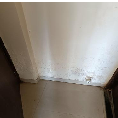

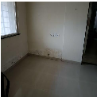

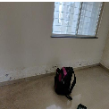

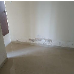

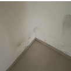

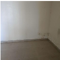

Photo 1 Photo 2 Photo 3 Photo 4 Photo 5 Photo 6

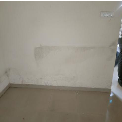

- Photo 7

Positive side Description

Common Bathroom tile

hollowness Positive side photographs

- Photo 8 Photo 9 Photo 10 Photo 11

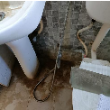

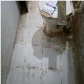

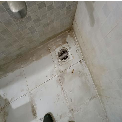

### Impacted Area 2

Bedroom Skirting level

Negative side Description

Dampness Negative side photographs

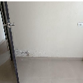

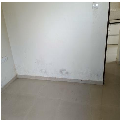

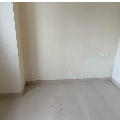

Common Bathroom tile

Positive side Description

#### hollowness Positive side photographs

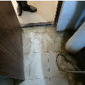

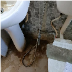

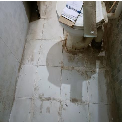

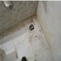

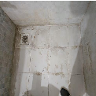

Photo 15 Photo 16 Photo 17 Photo 18 Photo 19

### Impacted Area 3

Negative side Description Master bedroom Skirting level

Dampness Negative side photographs

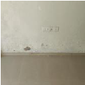

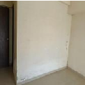

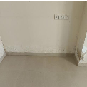

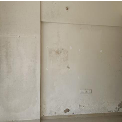

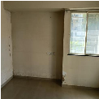

Photo 20 Photo 21 Photo 22 Photo 23 Photo 24 Photo 25

Positive side Description MB Bathroom tile hollowness

Positive side photographs

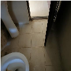

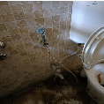

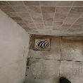

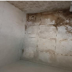

Photo 26 Photo 27 Photo 28 Photo 29 Photo 30

### Impacted Area 4

Kitchen Skirting level

Negative side Description

#### Dampness Negative side photographs

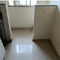

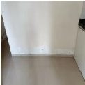

Photo 31 Photo 32

#### Positive side Description Master bedroom bathroom Positive side photographs

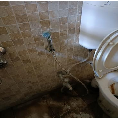

Photo 33 Photo 34 Photo 35 Photo 36 Photo 37

### Impacted Area 5

Negative side Description Master bedroom wall damness Negative side photographs

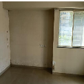

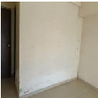

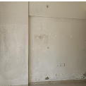

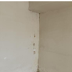

Photo 38 Photo 39 Photo 40 Photo 41

Positive side Description External wall crack and Duct

Issue Positive side photographs

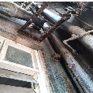

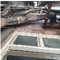

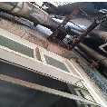

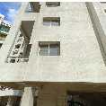

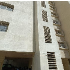

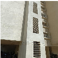

Photo 42 Photo 43 Photo 44 Photo 45 Photo 46 Photo 47

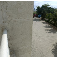

- Photo 48

### Impacted Area 6

Negative side Description Parking Area seepage Negative side photographs

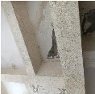

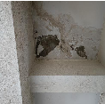

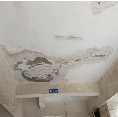

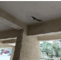

- Photo 49 Photo 50 Photo 51 Photo 52

Common Bathroom tile hollowness and plumbing issue

Positive side Description

#### Positive side photographs

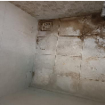

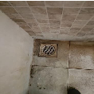

Photo 53 Photo 54 Photo 55 Photo 56 Photo 57

### Impacted Area 7

Common Bathroom Ceiling

Negative side Description

#### Dampness Negative side photographs

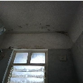

- Photo 58

outlet Leakage

Positive side Description Flat no 203 tile joint open and

Positive side photographs

- Photo 59 Photo 60 Photo 61 Photo 62 Photo 63 Photo 64

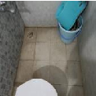

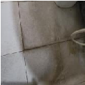

Checklists 1 flagged, 84.21%

## Inspection Checklists 1 flagged, 84.21%

#### Checklist: WC

External wall

Condition of leakage at adjacent walls

Condition of leakage below WC

Leakage during: All time

Leakage due to concealed plumbing Yes

Leakage due to damage in Nahani trap/Brickbat coba under tile flooring

Yes

### Positive Side Inputs For WC 100%

Gaps/Blackish dirt Observed in tile joints Yes

Gaps around Nahani Trap Joints Yes

Tiles Broken/Loosed anywhere No

Loose Plumbing joints/rust around joints and edges (Flush Yes Tank/shower/angle cock/bibcock, washbasin, etc)

Moderate

Type of tile

### Negative Side Inputs For External Wall 75%

Condition of leakage at interior side

Leakage during: All time

Leakage due to concealed plumbing Yes

Internal WC/Bath/Balcony leakage observed Yes

### Positive Side Inputs for External Wall 100%

Existing type of paint and manufacturer Not sure

Stuctural Condition of RCC Members 100%

Condition of cracks observed on RCC Column and Beam Moderate

Condition of rust marks observed in RCC Beam and Column N/A

Condition of corrosion/spalling of concrete/exposed reinforcement observed in column/beams/roof slab ceiling

N/A

Expansion joints condition if any N/A

### Condition of External wall 100%

Are there any major or minor cracks observed over external surface?

Moderate Are the sealants applied on the window frame joints intact? N/A Condition of wall mounted AC Frames, holes, drain pipes over the wall. Are the external plumbing pipes cracked and leaked? If yes its condition. Are the openings around the pipes in external wall properly grouted? If not its condition. Condition of any vegetation growth, dish antennas fixed on parapet wall observed?

N/A

Moderate

N/A

N/A

### Condition of Adhesion of old paint 100%

Chalking and flaking in paint film. N/A

Algae fungus and Moss observed on external wall? Moderate

Bird droppings condition observed on external wall and Chajja N/A

Condition of corrosion on metal rods and MS window grills N/A

### Substrate condition of Plaster

Patchwork plaster required? if yes its condition? N/A

Entire replaster required? if yes its condition? N/A

Condition of separation cracks observed at beam-column N/A junction

Condition of leakage observed from overhead water tank N/A

#### Loose plaster/hollow sond on external surfaces?if observed, N/A

## SUMMARY TABLE

|Point No  |Impacted area (-ve side)|Point No  |Exposed area (+ve side)|
|---|---|---|---|
|1|Observed dampness at the skirting level of Hall of Flat No. 103|1.1|Observed gaps between the tile joints of Common Bathroom of Flat No. 103|
|2|Observed dampness at the skirting level of the Common Bedroom of Flat No. 103|2.1|Observed gaps between the tile joints of Common Bathroom of Flat No. 103|
|3|Observed dampness at the skirting level of Master Bedroom of Flat No. 103|3.1|Observed gaps between the tile joints of Master Bedroom Bathroom of Flat No. 103|
|4|Observed dampness at the skirting level of Kitchen of Flat No. 103|4.1|Observed gaps between the tile joints of Master Bedroom Bathroom of Flat No. 103|
|5|Observed dampness & efflorescence on the wall surface of Master Bedroom of Flat No. 103|5.1|Observed cracks on the External wall of building near Master Bedroom of Flat No. 103|
|6|Observed leakage at the Parking ceiling below Flat No. 103|6.1|Observed plumbing issue & gaps between the tile joints of Common Bathroom of Flat No. 103|
|7|Observed mild dampness at the ceiling of Common Bathroom of Flat No. 103|7.1|Observed gap between tile joints of Common & Master Bedroom Bathrooms of Flat No. 203.|

#### Appendix

Photo 1 Photo 2

Photo 3 Photo 4

Photo 5 Photo 6

Photo 7 Photo 8

Photo 9 Photo 10

Photo 11 Photo 12

Photo 13 Photo 14

Photo 15 Photo 16

Photo 17 Photo 18

Photo 19 Photo 20

Photo 21 Photo 22

Photo 23 Photo 24

Photo 25 Photo 26

Photo 27 Photo 28

Photo 29 Photo 30

Photo 31 Photo 32

Photo 33 Photo 34

Photo 35 Photo 36

Photo 37 Photo 38

Photo 39 Photo 40

Photo 41 Photo 42

Photo 43 Photo 44

Photo 45 Photo 46

Photo 47 Photo 48

Photo 49 Photo 50

Photo 51 Photo 52

Photo 53 Photo 54

Photo 55 Photo 56

Photo 57 Photo 58

Photo 59 Photo 60

Photo 61 Photo 62

Photo 63 Photo 64

