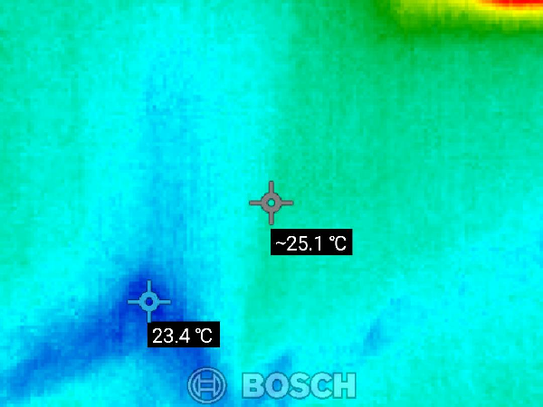

28.8 °C

23.4 °C

# 27/09/22

|  Hotspot : 28.8 °C    Coldspot : 23.4 °C    Emissivity : 0.94    Reflected temperature : 23 °C|
|---|

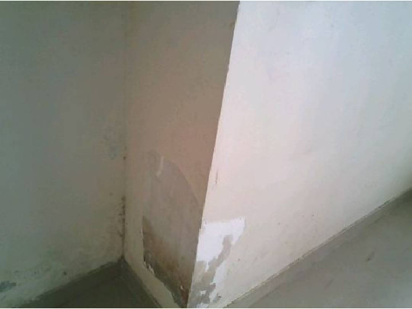

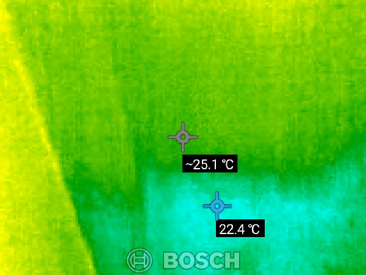

27.4 °C

22.4 °C

# 27/09/22

|  Hotspot : 27.4 °C    Coldspot : 22.4 °C    Emissivity : 0.94    Reflected temperature : 23 °C|
|---|

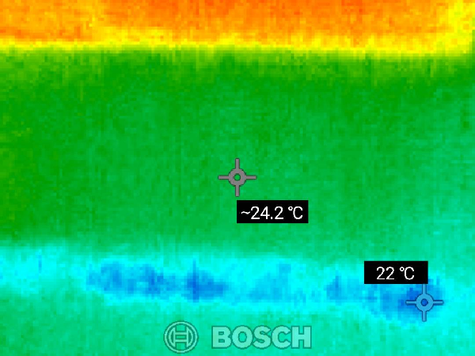

27 °C

22 °C

# 27/09/22

|  Hotspot : 27 °C    Coldspot : 22 °C    Emissivity : 0.94    Reflected temperature : 23 °C|
|---|

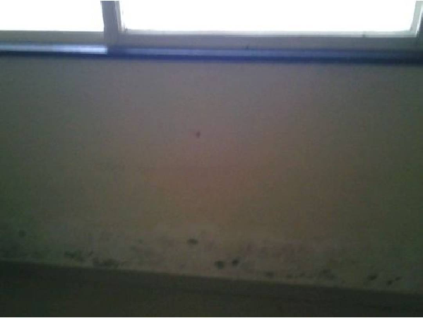

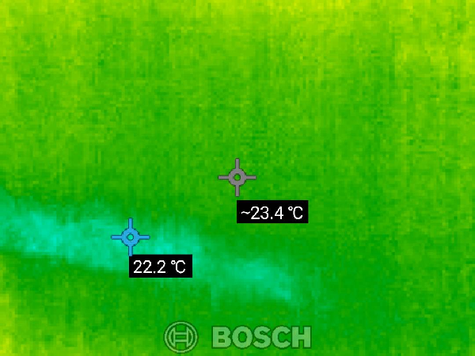

- 25.7 °C

- 20.7 °C

# 27/09/22

|  Hotspot : 25.7 °C    Coldspot : 20.7 °C    Emissivity : 0.94    Reflected temperature : 23 °C|
|---|

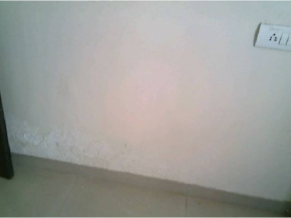

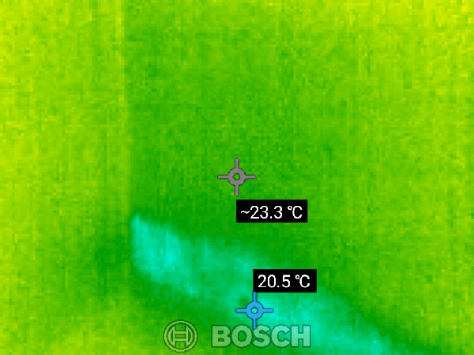

25.5 °C

- 20.5 °C

# 27/09/22

|  Hotspot : 25.5 °C    Coldspot : 20.5 °C    Emissivity : 0.94    Reflected temperature : 23 °C|
|---|

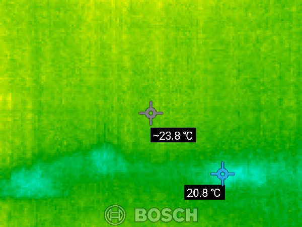

- 25.8 °C

- 20.8 °C

# 27/09/22

|  Hotspot : 25.8 °C    Coldspot : 20.8 °C    Emissivity : 0.94    Reflected temperature : 23 °C|
|---|

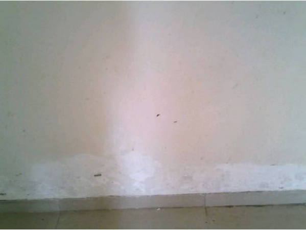

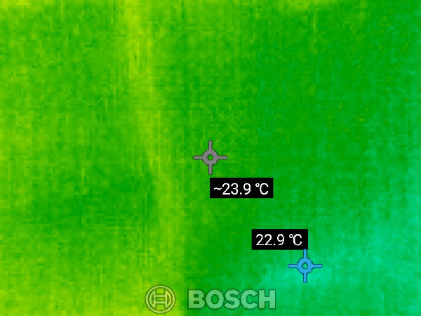

26.2 °C

- 21.2 °C

# 27/09/22

|  Hotspot : 26.2 °C    Coldspot : 21.2 °C    Emissivity : 0.94    Reflected temperature : 23 °C|
|---|

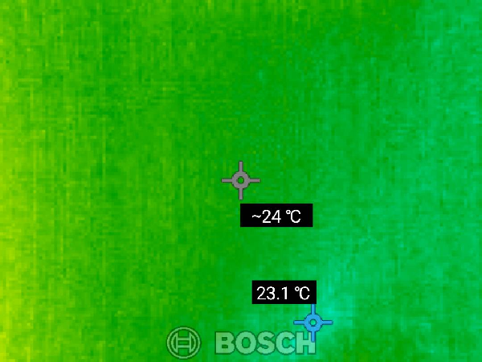

26.5 °C

21.5 °C

# 27/09/22

|  Hotspot : 26.5 °C    Coldspot : 21.5 °C    Emissivity : 0.94    Reflected temperature : 23 °C|
|---|

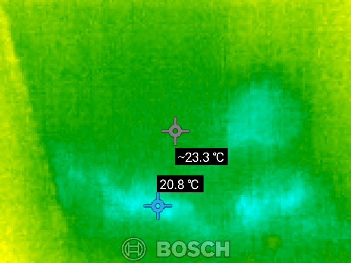

|  Hotspot : 25.8 °C    Coldspot : 20.8 °C    Emissivity : 0.94    Reflected temperature : 23 °C|
|---|

## 20.8 °C

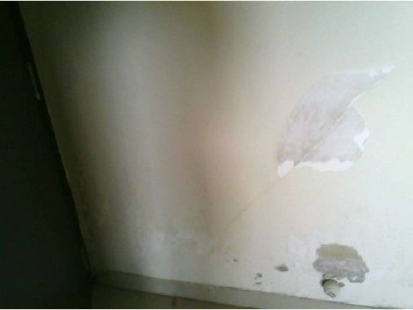

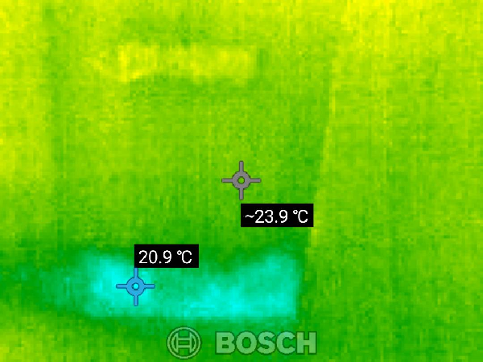

|  Hotspot : 25.9 °C    Coldspot : 20.9 °C    Emissivity : 0.94    Reflected temperature : 23 °C|
|---|

## 20.9 °C

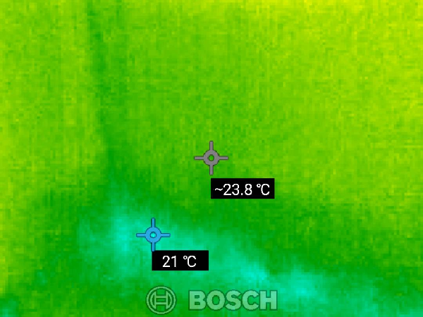

26 °C

21 °C

# 27/09/22

|  Hotspot : 26 °C    Coldspot : 21 °C    Emissivity : 0.94    Reflected temperature : 23 °C|
|---|

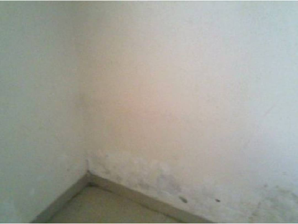

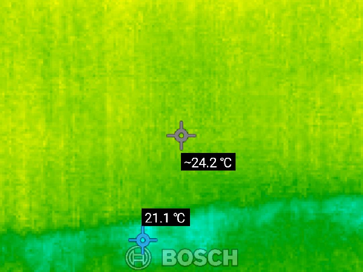

26.1 °C

21.1 °C

# 27/09/22

|  Hotspot : 26.1 °C    Coldspot : 21.1 °C    Emissivity : 0.94    Reflected temperature : 23 °C|
|---|

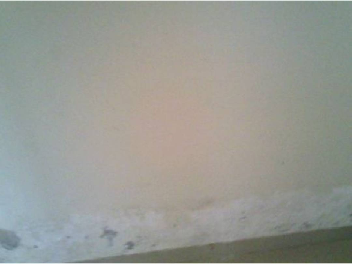

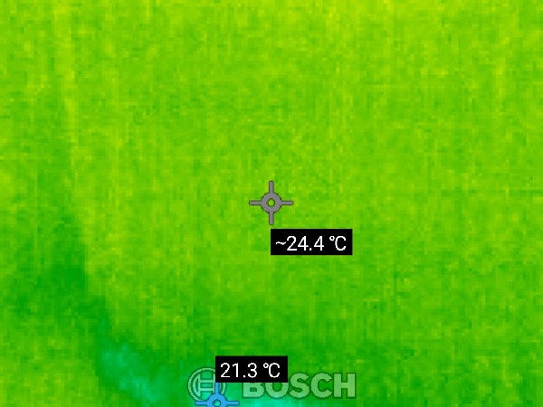

|  Hotspot : 26.3 °C    Coldspot : 21.3 °C    Emissivity : 0.94    Reflected temperature : 23 °C|
|---|

## 21.3 °C

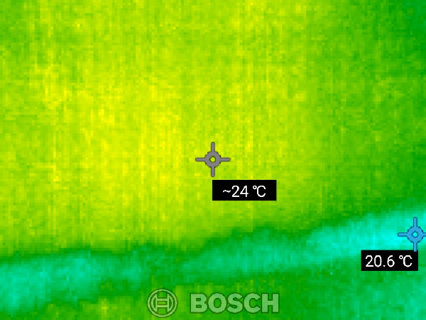

25.6 °C

- 20.6 °C

# 27/09/22

|  Hotspot : 25.6 °C    Coldspot : 20.6 °C    Emissivity : 0.94    Reflected temperature : 23 °C|
|---|

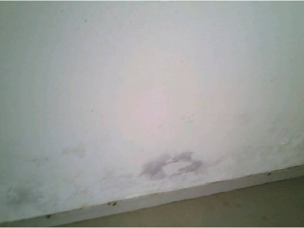

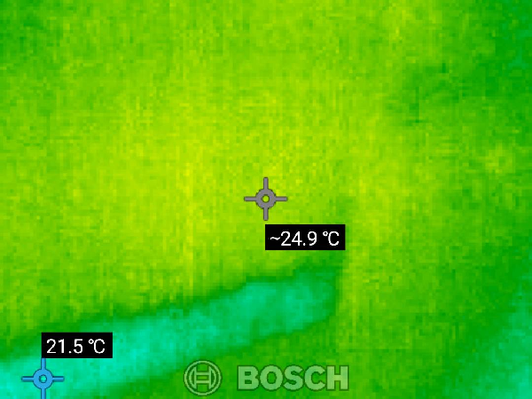

|  Hotspot : 26.5 °C    Coldspot : 21.5 °C    Emissivity : 0.94    Reflected temperature : 23 °C|
|---|

## 21.5 °C

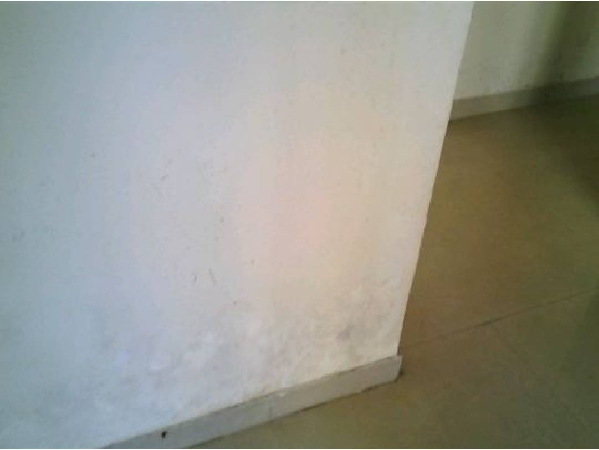

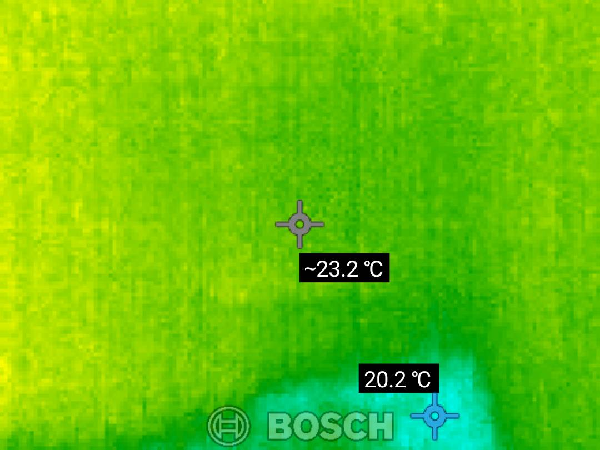

25.2 °C

20.2 °C

# 27/09/22

|  Hotspot : 25.2 °C    Coldspot : 20.2 °C    Emissivity : 0.94    Reflected temperature : 23 °C|
|---|

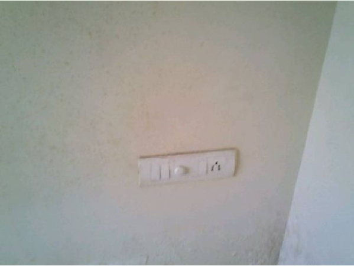

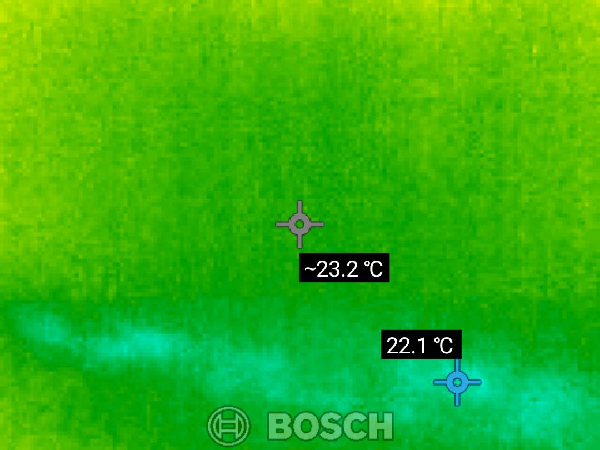

25.6 °C

20.6 °C

# 27/09/22

|  Hotspot : 25.6 °C    Coldspot : 20.6 °C    Emissivity : 0.94    Reflected temperature : 23 °C|
|---|

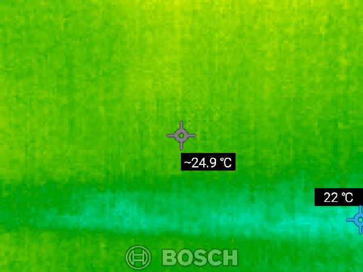

27 °C

22 °C

# 27/09/22

|  Hotspot : 27 °C    Coldspot : 22 °C    Emissivity : 0.94    Reflected temperature : 23 °C|
|---|

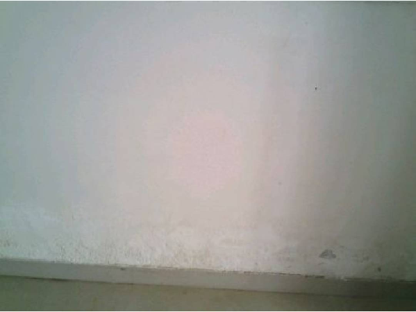

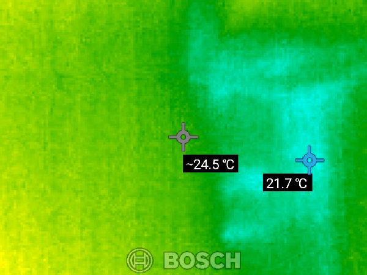

26.7 °C

21.7 °C

# 27/09/22

|  Hotspot : 26.7 °C    Coldspot : 21.7 °C    Emissivity : 0.94    Reflected temperature : 23 °C|
|---|

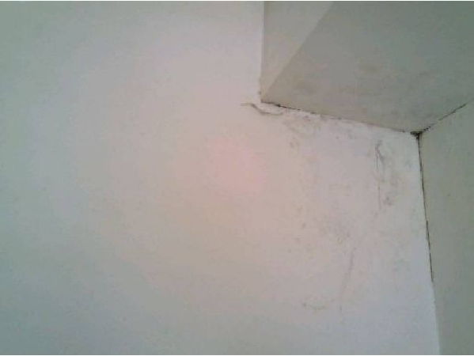

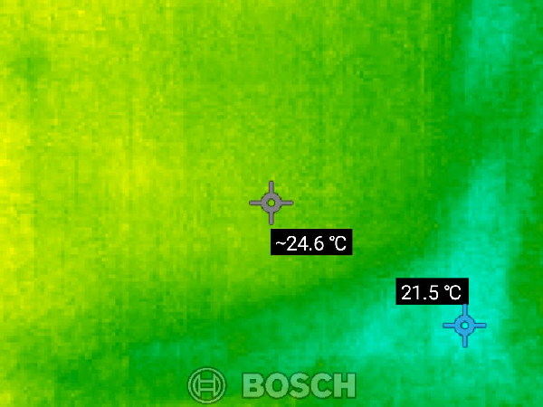

26.5 °C

21.5 °C

# 27/09/22

|  Hotspot : 26.5 °C    Coldspot : 21.5 °C    Emissivity : 0.94    Reflected temperature : 23 °C|
|---|

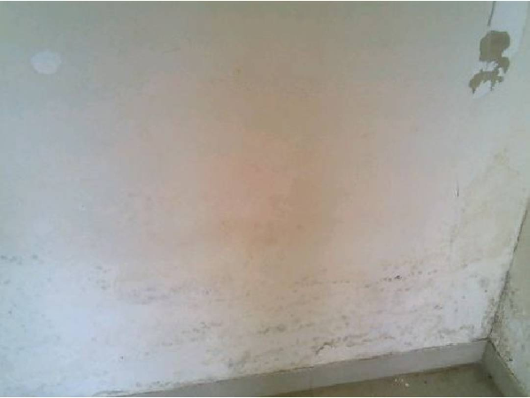

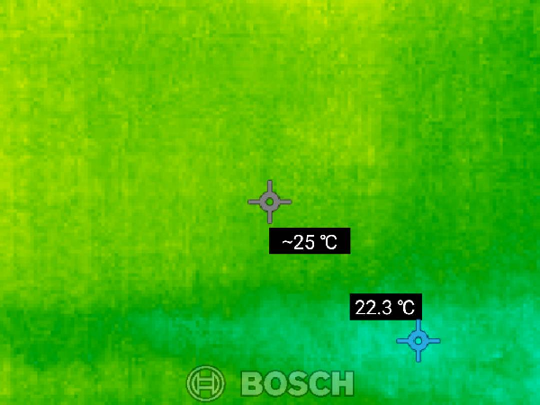

|  Hotspot : 27.3 °C    Coldspot : 22.3 °C    Emissivity : 0.94    Reflected temperature : 23 °C|
|---|

## 22.3 °C

|  Hotspot : 27.3 °C    Coldspot : 22.3 °C    Emissivity : 0.94    Reflected temperature : 23 °C|
|---|

## 22.3 °C

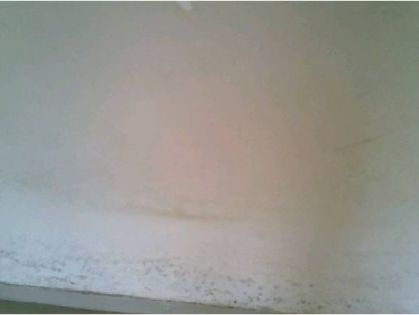

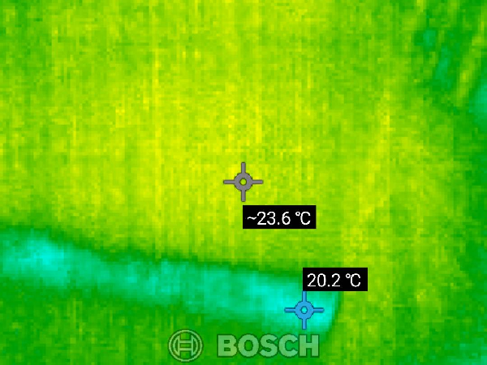

25.2 °C

- 20.2 °C

# 27/09/22

|  Hotspot : 25.2 °C    Coldspot : 20.2 °C    Emissivity : 0.94    Reflected temperature : 23 °C|
|---|

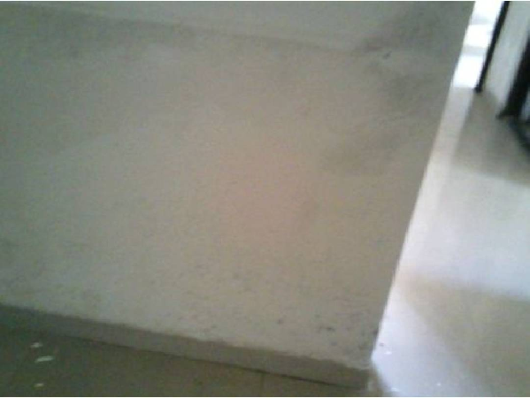

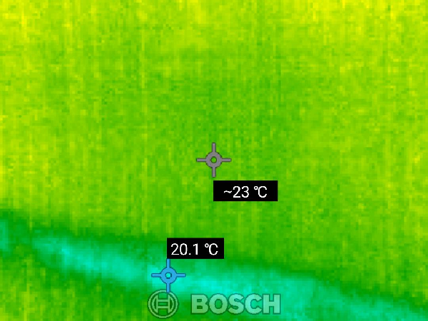

25.1 °C

20.1 °C

# 27/09/22

|  Hotspot : 25.1 °C    Coldspot : 20.1 °C    Emissivity : 0.94    Reflected temperature : 23 °C|
|---|

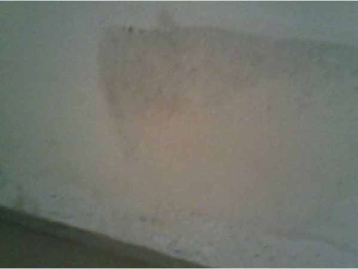

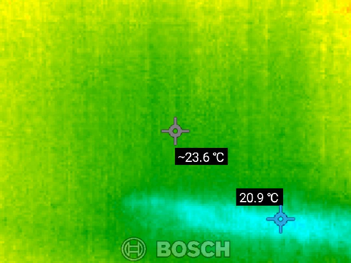

|  Hotspot : 25.9 °C    Coldspot : 20.9 °C    Emissivity : 0.94    Reflected temperature : 23 °C|
|---|

## 20.9 °C

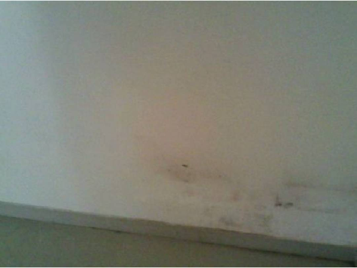

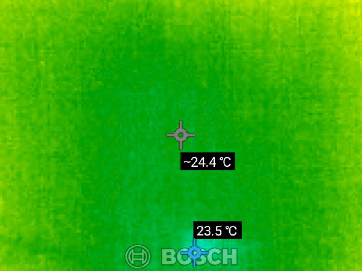

|  Hotspot : 26.9 °C    Coldspot : 21.9 °C    Emissivity : 0.94    Reflected temperature : 23 °C|
|---|

## 21.9 °C

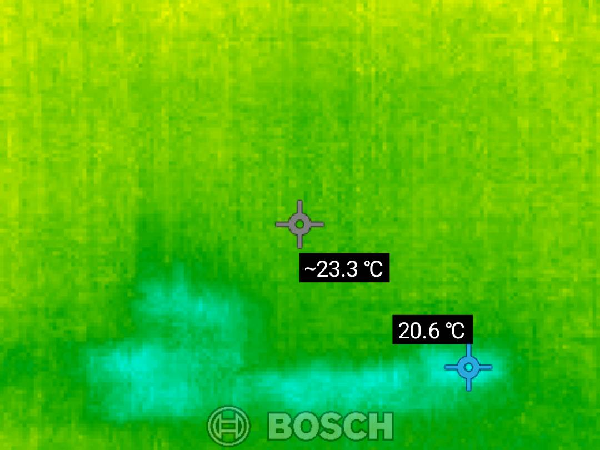

- 25.6 °C

20.6 °C

# 27/09/22

|  Hotspot : 25.6 °C    Coldspot : 20.6 °C    Emissivity : 0.94    Reflected temperature : 23 °C|
|---|

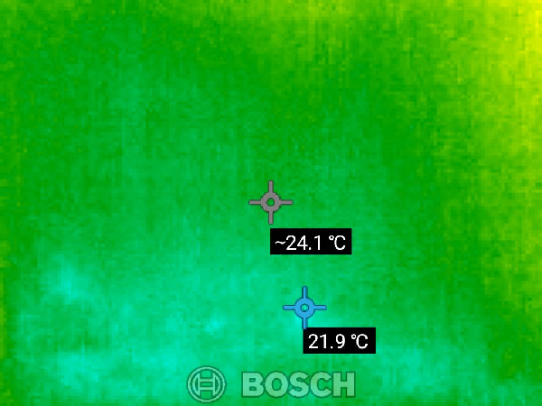

|  Hotspot : 26.9 °C    Coldspot : 21.9 °C    Emissivity : 0.94    Reflected temperature : 23 °C|
|---|

## 21.9 °C

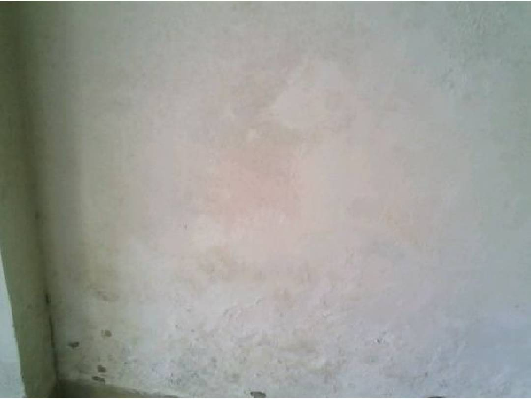

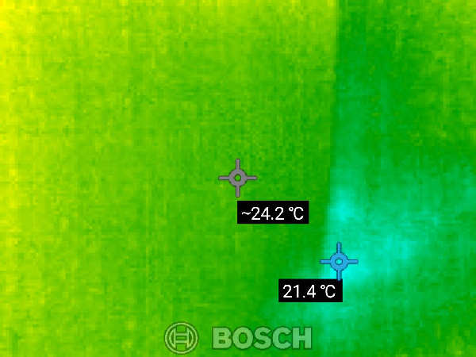

- 26.4 °C

- 21.4 °C

# 27/09/22

|  Hotspot : 26.4 °C    Coldspot : 21.4 °C    Emissivity : 0.94    Reflected temperature : 23 °C|
|---|

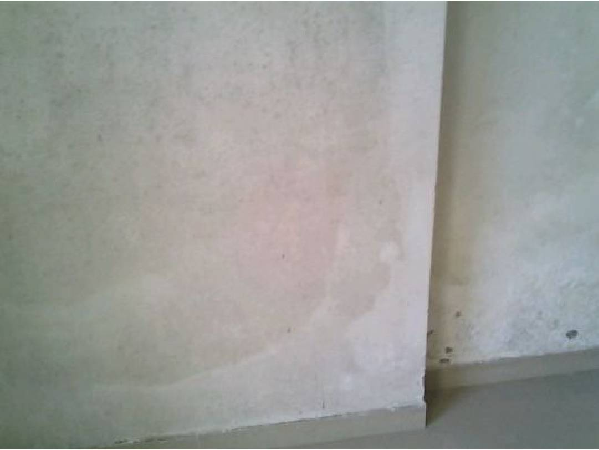

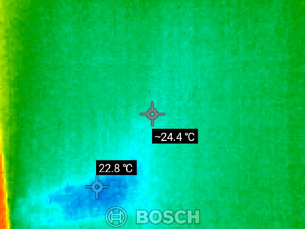

- 27.8 °C

- 22.8 °C

# 27/09/22

|  Hotspot : 27.8 °C    Coldspot : 22.8 °C    Emissivity : 0.94    Reflected temperature : 23 °C|
|---|

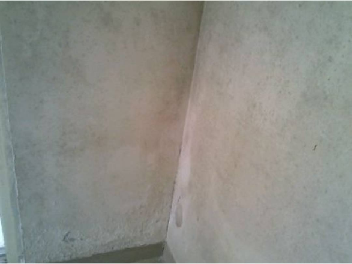

